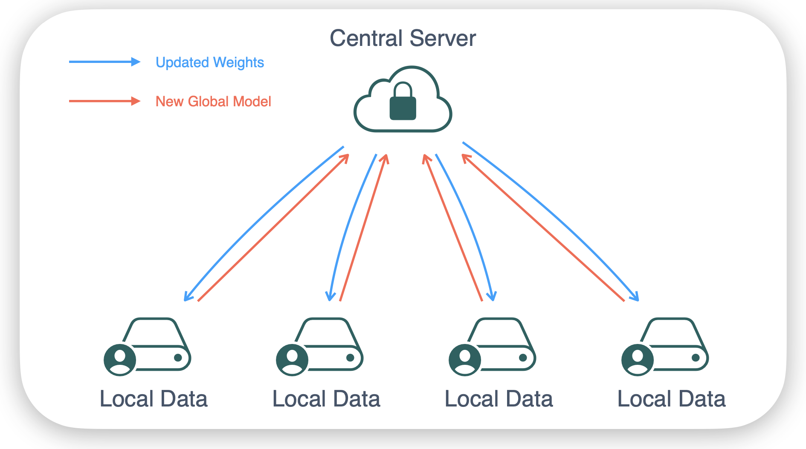
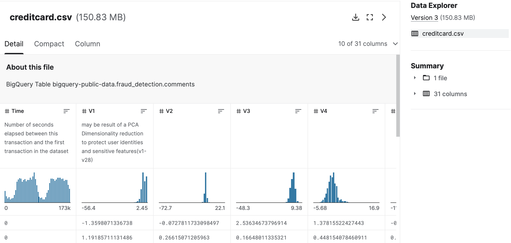
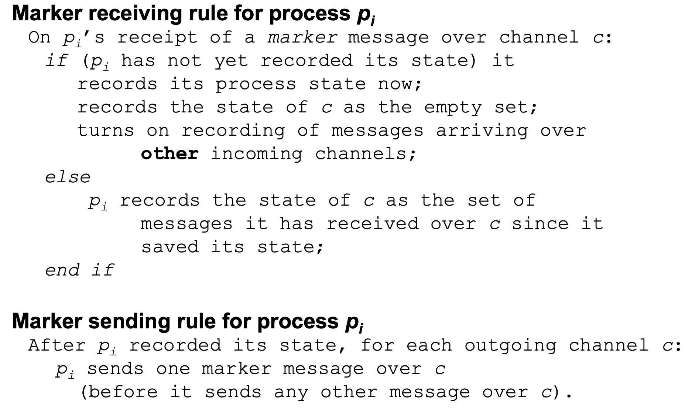
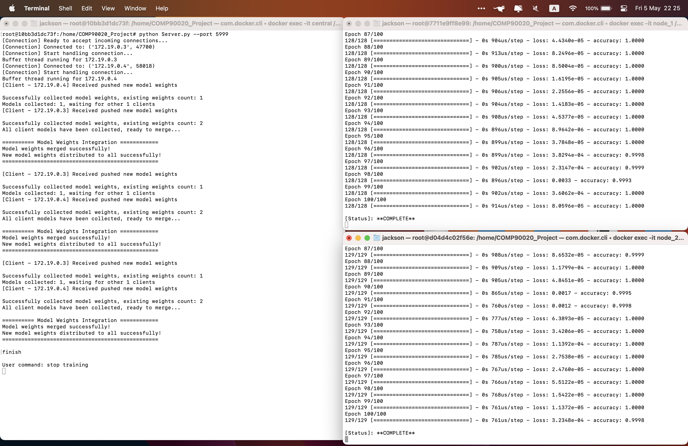
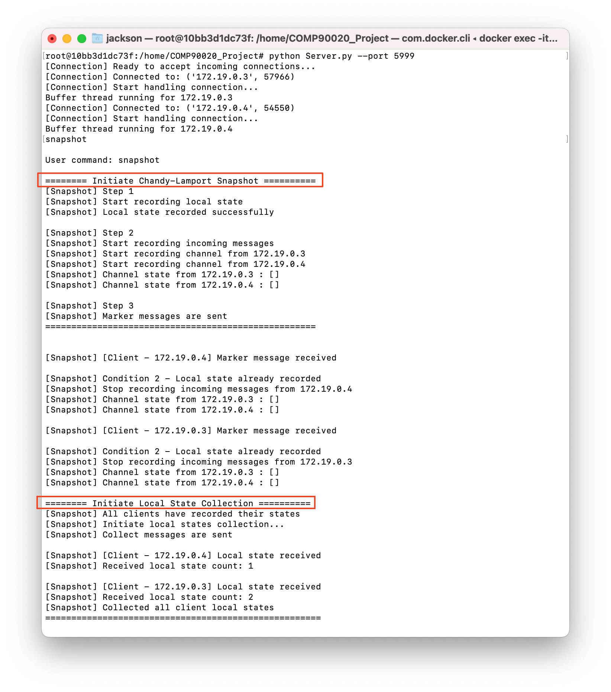
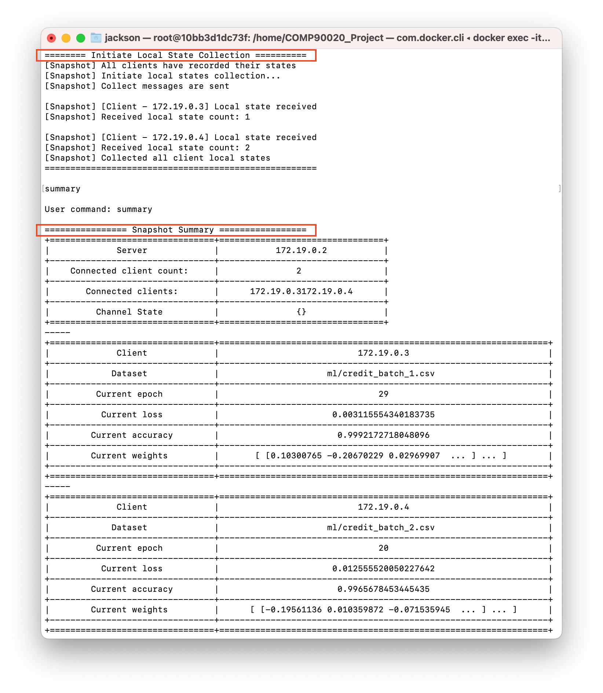

# COMP90020 Project - Snapshots in Federated Learning

## Introduction
This is a project of COMP90020 Distributed Algorithms. 
A distributed system tends to be designed for a scenario in federated learning with the Chandy-Lamport algorithm implemented to monitor system performance and evaluate produced machine learning models.
The distributed system is simulated with Docker container under the same Docker network configuration.
Our scenario is to classify fraud credit card transactions while each node may only be allowed to access its own local dataset for privacy and security concerns like in practical settings.
Tensorflow is imported to be used as the main framework for the model training. Models trained locally on each node are coordinated to merge their weights to improve the global model without the exchange of local datasets.

## Team - Red Queen
| Name       	| Student ID 	| Email                          	|
|------------	|------------	|--------------------------------	|
| Renwei Hu  	| 1067974    	| renweih@student.unimelb.edu.au 	|
| Zicheng Mu 	| 1261665    	| zmu1@student.unimelb.edu.au    	|

## Federated Learning - Credit Card Fraud Classification
### What is Federated Learning
Federated learning refers to a decentralised approach in machine learning where a single global model is trained across multiple local devices or servers, with each having access to its own local dataset.
Unlike the traditional approach where all data is collected and trained on a central server, federated learning assumes sensitive data are kept locally for privacy and security concerns.
A central server is responsible for aggregating model updates and pushing the new global model while the actual training happens in each node with local datasets



### Credit Card Fraud Classification
It's critical to identify unusual credit card transaction to prevent customers from potential cases of credit card fraud.
A large dataset containing 30 credit card transaction related features are found on [Kaggle](https://www.kaggle.com/datasets/mlg-ulb/creditcardfraud). 
The dataset consists more than 280,000 transaction records with each record labeled as fraud or not respectively.

The original imbalanced dataset is pre-processed to contain balanced classes and then split into a few smaller datasets which saved as csv files.
Those csv files are distributed to each worker node as local dataset so there is no aggregated global dataset for central training.
Each worker node only accesses corresponding dataset to simulate the isolated data storage in federated learning.



## Chandy-Lamport Snapshot
Chandy-Lamport algorithm is the first effective and widely used snapshot algorithm, and many variants were derived from it. It has been proven to be relatively simple to use and can readily obtain a global state by assembling all the local snapshots. 
In addition, the algorithm has been adapted into many real-world applications, such as Apache Flink and Google Chubby.



## Tech Stacks
- Docker
- Tensorflow
- Jupyter Notebook

## Packages
- pandas
- numpy
- tensorflow
- keras
- imbalanced-learn

## Folder Structure
```shell
.
├── Client.py
├── ClientState.py
├── CommHelper.py
├── README.md
├── Server.py
├── ServerState.py
├── TfDistributor.py
├── TfModel.py
├── ml
│   ├── Fraud Transaction Detection.ipynb
│   ├── Fraud Transaction Detection - Preprocessing.ipynb
│   ├── credit_batch_1.csv
│   ├── credit_batch_2.csv
│   ├── credit_batch_3.csv
│   ├── model.png
│   └── pretrained_model
└── requirements.txt
```
### Files
- `Server.py` - Main logic of the server node
- `ServerState.py` - Object representing the state of a server
- `Client.py` - Main logic of a worker node
- `ClientState.py` - Object representing the state of a client
- `TfDistributor.py` - Responsible for merging pushed model weights, attached to server node
- `TfModel.py` - The machine learning model, locally trained on each worker node
- `CommHelper.py` - Helper module for socket sending/receiving pickle encapsulated data
### Folders
- `ml` - Contains some Jupyter Notebook for tensorflow experiment & credit card datasets
- `pretrained_model` - A exported tensorflow model for experiment

## How to Run
1. Create a Docker network with command `docker create network <network_name>`
2. Launch several Docker container attached to that network (base: `Ubuntu`)
3. Install Python & packages listed in `requirements.txt`
4. Copy the project folder into containers using `docker cp` command
5. Enter Docker containers and direct to project folder
6. Launch server - `python Server.py --port <port_number>`
7. Launch client - `python Client.py --server <server_ip> --port <port_number> --data <dataset_file_path>`
### Example Commands
- `python Server.py --port 5999`
- `python Client.py --server 172.19.0.2 --port 5999 --data ml/credit_batch_2.csv`

## Application Screenshots
### Model Training


### Initiate Snapshot


### Collect & Merge Local States
